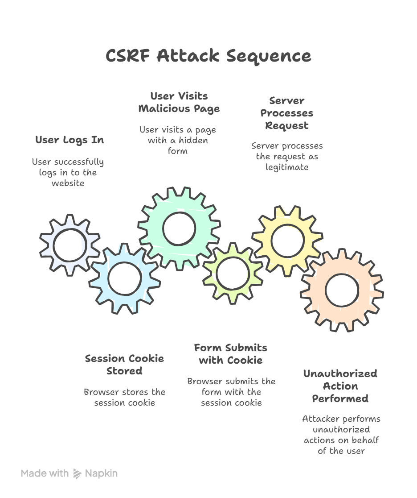

# 12.3 Protecting PHP Applications with CSRF Tokens

## 🎓 **The Hidden Threat**

At this point, your applications can identify users and control what they’re allowed to do.
But there’s still one big security hole we need to close — **CSRF attacks**, or **Cross-Site Request Forgery**.

A CSRF attack tricks a logged-in user into performing an action they never intended — like deleting a record or submitting a form — simply because their browser is already authenticated.

In this video, we’ll explore what CSRF is, how it works, and how you can stop it using **CSRF tokens** in PHP.

---

## ⚠️ **1. What Is a CSRF Attack?**



Here’s what happens during a CSRF attack:

1. A user logs in to your site — say, *internship-portal.com*.
2. Their browser stores a valid session cookie, like `PHPSESSID`.
3. While still logged in, they visit a malicious page that contains a hidden form submitting to your site.
4. The browser automatically includes the user’s cookie, so your server thinks it’s a legitimate request.

The result? The attacker can make your site perform actions *on behalf of the user*, without their knowledge.

---

## 🧠 **2. How CSRF Tokens Fix the Problem**

The defense is simple:
Each form that performs an important action — like changing a password or deleting a record — includes a **CSRF token**.

That token is:

* **Unique per session**
* **Stored on the server**, and
* **Submitted with the form**

When the server receives the form, it checks that the submitted token matches the one in the session.
If they don’t match, the request is rejected.

This ensures that only legitimate requests from your site are accepted — not forged ones from somewhere else.

---

## ⚙️ **3. Step-by-Step Implementation**

Let’s walk through how to generate and verify CSRF tokens in PHP.

---

### Step 1 – Generate the Token

**`12-3-csrf.php`**

```php
<?php
declare(strict_types=1);

function generateCsrfToken(): string {
    if (empty($_SESSION['csrfToken'])) {
        $_SESSION['csrfToken'] = bin2hex(random_bytes(32));
    }
    return $_SESSION['csrfToken'];
}
```

This function creates a random 64-character token using PHP’s `random_bytes()` function — which is cryptographically secure — and stores it in the session.
If the token already exists, it reuses it for that session.

---

### Step 2 – Embed the Token in a Form

**`12-3-delete-selection.php`**

```php
<?php
session_start();
require_once '12-3-csrf.php';

$token = generateCsrfToken();
?>
<!DOCTYPE html>
<html lang="en">
<head>
  <meta charset="UTF-8">
  <title>Delete Selection</title>
</head>
<body>
  <h2>Delete Selection</h2>
  <form method="post" action="12-3-delete-selection.php">
    <input type="hidden" name="csrf_token" value="<?php echo htmlspecialchars($token); ?>">
    <p>Are you sure you want to delete this selection?</p>
    <p><input type="submit" value="Confirm Delete"></p>
  </form>
</body>
</html>
```

Now, every form generated by this page includes the CSRF token as a hidden input.
When the user submits the form, the token travels with the POST data.

---

### Step 3 – Validate the Token on Submission

```php
<?php
session_start();
require_once '12-3-csrf.php';

if ($_SERVER['REQUEST_METHOD'] === 'POST') {
    $token = $_POST['csrf_token'] ?? '';

    if (!hash_equals($_SESSION['csrfToken'] ?? '', $token)) {
        http_response_code(403);
        exit('<h2>Invalid CSRF token. Request denied.</h2>');
    }

    // Safe to proceed with the deletion
    echo "<p>Selection deleted successfully.</p>";

    // Optionally invalidate token to prevent reuse
    unset($_SESSION['csrfToken']);
}
```

Here, we compare the submitted token to the one stored in the session using [`hash_equals()`](https://www.php.net/manual/en/function.hash-equals.php), which prevents timing attacks. If the check fails, the request is rejected with a **403 Forbidden** response.

For extra security, you can unset the token after a successful validation — making it valid for one submission only.

What is a timing attack and how does `hash_equals()` protect against it? In simple terms, PHP's `hash_equals()` function prevents timing attacks by taking the exact same amount of time to compare two strings, regardless of where they differ. This stops an attacker from using a "stopwatch" to guess sensitive information, such as passwords or API keys, one character at a time.

When you use a standard comparison operator like == or === in most programming languages, including PHP, the comparison stops as soon as it finds the first character that doesn't match.

* If you compare "apple" and "apricot", the system stops at the third character (p vs. r) and returns "false" very quickly.
* If you compare "apple" and "applepie", it gets through all five letters before stopping and takes slightly longer.

This time difference, though minuscule (nanoseconds or microseconds), can be measured by a skilled attacker who sends a large number of guesses and statistically analyzes the response times. A longer response time indicates that more characters matched the secret string, allowing the attacker to deduce the correct characters one by one.

---

## 🧩 **4. Seeing It in Action**

Let’s test it.

1. Load the page normally — you’ll see the confirmation form with a hidden CSRF token.
2. Submit the form — the action succeeds because the token matches.
3. Now, open DevTools and remove or alter the `csrf_token` value.
4. Submit again — you’ll see “Invalid CSRF token” and a 403 error.

That’s proof your protection is working.

---

## 🔒 **5. When and Where to Use CSRF Tokens**

Use CSRF tokens for any action that changes data or performs a stateful operation, including:

* Form submissions
* Deletions or updates
* Account or password changes
* AJAX requests that modify server data

For simple **read-only pages** (like viewing data), CSRF protection isn’t needed.

---

## 🧩 **6. Token Lifecycle and Best Practices**

A few best practices to remember:

* Regenerate tokens after login or other sensitive actions.
* Use `random_bytes()` for secure randomness.
* Escape the token with `htmlspecialchars()` when outputting it.
* Always send forms over HTTPS.
* Never share CSRF tokens between users or sessions.

---

## 🧠 **7. Modern PHP Support**

Newer PHP versions provide all the tools you need for CSRF protection out of the box:

* `random_bytes()` and `random_int()` for cryptographic randomness
* `hash_equals()` for safe token comparison
* Strict typing to avoid loose comparisons
* Session controls for secure cookie parameters

Together, these features make token-based protection easy and robust.

---

## ✅ **8. Wrap-Up**

So, to recap:

* CSRF attacks exploit your users’ authenticated sessions.
* CSRF tokens verify that requests actually come from your own site.
* Newer PHP versions give you simple, secure ways to generate and validate those tokens.

By combining CSRF protection with authentication and authorization, you create a solid foundation for secure PHP applications.

In our next video, we’ll look at **JSON Web Tokens**, or **JWTs** — a modern, stateless alternative for handling authentication across APIs and single-page applications.
