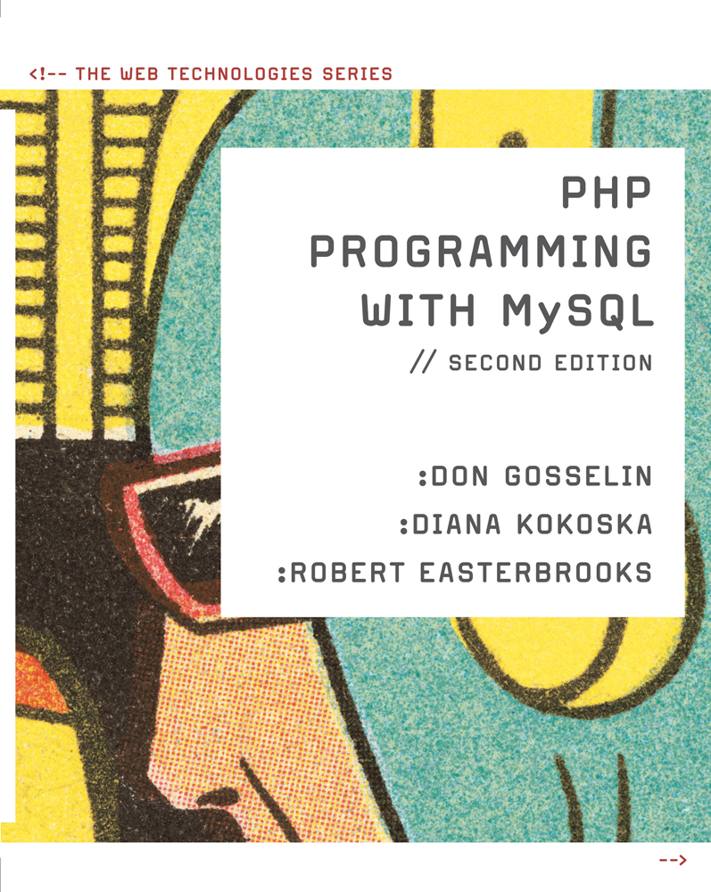

# CIS 334: PHP and MySQL: Fall 2025 (Online)

## Class Meetings

This course is delivered entirely online in an asynchronous format. Recorded lessons and written instructions will be provided in the Brightspace site.

## Course Description

This hands-on PHP Programming course is designed to provide the student with a theoretical foundation and applied skills required to use PHP as a Web publishing and data management tool. An integrated approach to Web development ties it to the HTML and CSS environments and establishes PHP’s place in the Web Development process. Functional examples and comprehensive hands-on lab activities will reinforce the concepts presented. (3 credits)

## Instructor

Nate LaClaire

- **Email:** <nathaniel.laclaire@maine.edu>
- **Telephone:** 207‐621‐3050
- **Office:** Katz Library, room 202

### Office Hours

I do not have set office hours but make my schedule available for students to schedule a time that is convenient for them. [Make An Appointment](https://natelaclaire.youcanbook.me/)

## Communication and Response Time

If you send me an email or leave a voicemail during the week, you should expect a response within 1 day. Over the weekend or on holidays, the response time will be longer. If I will be unable to respond for an extended period during the week, I will let students know in advance and will provide an email vacation auto-reply.

Homework that is turned in on time should be graded within 2-3 days. Homework turned in late may take longer for grading.

Any communications sent from my UMA email or from the Brightspace course will go to your @maine.edu address that was automatically created for you when you registered for this class. It will be important that during the semester you check this email regularly for information from your instructors and the institution. This is the email I will use to communicate with you regarding this course.

## Required Text and Materials

- [_PHP Programming with MySQL_](https://www.cengage.com/c/php-programming-with-mysql-the-web-technologies-series-2e-gosselin-kokoska-easterbrooks/9780538745840/)
  - by Don Gosselin, Diana Kokoska, Robert Easterbrooks.
  - ISBN 13: 9780538745840 © 2010
  - Publication date: 2010
  - 712 pages
  - Softcover
- Additional resources provided in Brightspace

## Required Software

Students will need a free GitHub account. Instructions will be provided in the first module. We will use GitHub Codespaces, a Web-based development environment, to complete assignments.

## Course Objectives

This course will introduce students to concepts used in PHP programming. This will include:

- PHP scripts
- Functions and control structures
- String manipulation
- User input
- Files and directories
- Arrays
- State information

Expect to work an average of six to nine hours a week on homework assignments, projects, discussion assignments, and studying. This may vary on any particular week depending on class workload.

## Learning Outcomes

At the completion of the course, the student should be able to:

- Create PHP code blocks
- Use functions to organize PHP code
- Learn about variable scope and autoglobal variables
- Use control structures, nested control structures, and looping structures
- Construct, parse, and compare text strings and use regular expressions
- Handle user input from forms and hyperlinks
- Work with files and directories
- Manipulate arrays

## Electronic Learning Tools

Participation in this course requires that you have access to high speed internet. This is especially critical for accessing online resources.

_Brightspace_ is a content management system that provides the interactive interface for students to access course materials, communicate with instructors and other students, and to upload homework assignments. The Brightspace site includes the syllabus as well as other course materials. If you have technical issues with Brightspace, consult the Student Tech Hub at (207) 621-3123 or <https://uma.edu/thehub>, or contact the UMS IT Helpdesk at 1-800-696-4357.

## Student Responsibilities

Students are responsible for reading the assigned material, performing the activities in the tutorial, completing any homework assignments and quizzes, and reviewing any supplementary materials available in Brightspace.

Expect to work an average of two to three hours per credit hour each week on class preparation and completion of assigned work in addition to your time spent in class or watching recorded class videos. This may vary on any particular week depending on class workload.

It is the students' responsibility to submit Homework Assignments on or before the due date.

Students may upload late homework assignments with _a ten-point deduction for each week_ late.

## Course Outline

To maximize your learning experience, you should:

- Watch the videos, complete the Applied Learning Activities* along with the instructor, and review any supplementary materials available in Brightspace.
- Communicate with the instructor if there is a concept that you do not understand.
- Complete Comprehension Check Quizzes in Brightspace on or before the due date.
- Complete Reinforcement Exercises* (during even-numbered weeks) on or before the due date.
- Complete Discovery Projects* (during odd-numbered weeks) on or before the due date.

*Note: The Applied Learning Activities, Reinforcement Exercises, and Discovery Projects will be completed by modifying the code provided via GitHub Classroom assignments and committing your work to the assignment's repository.

| Week        | Lesson / Assignment Topic                                              | Due Date (11:59pm) |
| ----------- | ---------------------------------------------------------------------- | ------------------ |
| 1           | Course Overview - Application Setup                                    | May 17             |
| 2           | Chapter 1 – Getting Started with PHP                                   | May 24             |
| 3           | Chapter 1 – Discovery Projects - **Final Project Topic Due**           | May 31             |
| 4           | Chapter 2 – Functions and Control Structures                           | June 7             |
| 5           | Chapter 2 – Discovery Projects                                         | June 14            |
| 6           | Chapter 3 – Constructing Text Strings                                  | June 21            |
| 7           | Chapter 3 – Discovery Projects                                         | June 28            |
| 8           | Chapter 4 – Coding Forms                                               | July 5             |
| 9           | Chapter 4 – Discovery Projects                                         | July 12            |
| 10          | Chapter 5 – File and Directory Handling                                | July 19            |
| 11          | Chapter 5 – Discovery Projects                                         | July 26            |
| 12          | Chapter 6 - Arrays                                                     | August 2           |
| 13          | Chapter 6 – Discovery Projects                                         | August 9           |
| 14          | Professional Tooling, Workflows, and Server Interaction Scenarios - **Final Project and Final Exam Due!**      | August 16          |

### Final Project

Each student will create a simple CRUD (create, read, update, delete) Web application as their final project, with data stored in a file. This will utilize the core PHP concepts covered in the course, including PHP syntax, functions, control structures, text manipulation, form handling, file handling, and arrays. A full description of the project along with a grading rubric will be available during the first week of the course, including a sample application topic. Each student will have the choice of either building the application described in the sample or creating their own application that meets the same requirements. Each student will submit their choice of final project topic during the third week of the course.

### Religious Holidays

Students may request accommodation for their observance of a religious holiday. Instructors may grant time accommodations such as excusing an absence, rescheduling a project deadline, or adjusting the exam schedule as long as it is deemed reasonable by the instructor. Students who anticipate a conflict must notify their instructor within two weeks of the official start of the academic session to make arrangements. In the case of an internship or clinicals, students should consult course faculty per the program policies as soon as possible.

## Grading Criteria

- **20%** of your grade will be determined by Applied Learning Activities.
- **20%** of your grade will be determined by Reinforcement Exercises.
- **20%** of your grade will be determined by Discovery Projects.
- **15%** of your grade will be determined by Comprehension Check Quizzes.
- **25%** of your grade will be determined by the Final Project.

A 94-100%, A- 90-93%, B+ 87-89%, B 83-86%, B- 80-82%, C+ 77-79%, C 73-76%, C- 70-72%, D+ 67-69%, D 63-66%, D- 60-62%, F below 60%.

## Communication

Students are encouraged to ask questions or make comments and/or suggestions. This helps you reinforce your learning and maximize your learning experience. The Brightspace content management system is available for student chat discussions, email communication, and to view course announcements at <https://courses.maine.edu/d2l/home>

For purposes of this class, communication is defined as interactively engaging with the Brightspace system, contacting the instructor via email or phone if you have questions outside of class, and responding to the instructor's emails or phone calls.

## Academic Integrity

Academic integrity means that a student's work is the product of their own effort. Violations of academic integrity include such behaviors as cheating, fabrication, and plagiarism, and are described more fully in the UMA Student Academic Integrity Code, which is published in the online UMA Student Handbook. Each student is responsible for learning the standards of academic integrity and ensuring that their work meets these standards. Failure to do so may result in appropriate sanctions consistent with the UMA Student Academic Integrity Policy. If you have questions about the academic integrity of your work, discuss these with your instructor before submitting the work. The full policy can be found at <https://www.uma.edu/compliance/handbook/academic-integrity/>.

### Generative Artificial Intelligence

Students are welcome to use generative artificial intelligence (AI) tools (including ChatGPT, Microsoft Copilot, Google Gemini, and others) for brainstorming, ideation, and producing Web page content. If you use any generative AI tool as part of an assignment, you must include a statement describing how you used it. For example, if you use it for writing the content for your final project's home page, include in your submission comments:

1. Which tool you used
2. The prompt that you used (what you typed into the tool)
3. A brief explanation of how much of the tool's output you used and how much you changed

## Class Withdrawals

Before withdrawing from a class, students are encouraged to contact the instructor. The instructor may be able to offer an alternative to dropping the class. Ultimately, if a student finds it necessary to withdraw from a class, students must follow school policy. Students who just stop attending a class, but who have not officially withdrawn, will receive a grade based on work completed up until the last date of attendance. Most often, this results in a failing grade. _Students are not automatically withdrawn from a class._

- _L Grade:_ The grade of “L” is awarded if you stop attending, but do not withdraw from the course. The “L” grade is computed into the grade point average as a failing grade and may affect a student’s financial aid eligibility.
- _W Grade:_ The grade of “W”, withdraw, is posted if you drop the course during the first 60% of the semester. A “W” grade is not computed into the grade point average. After the 60% point, the grade of WF may be assigned and may affect a student’s financial aid eligibility.
- _WF Grade:_ The grade awarded when a course is dropped after 60% of the term is completed depends upon your performance up to that point. If you are passing the course the grade of “W” is awarded. If you are failing the course at the time of withdrawal the grade of “WF”, withdraw failing, may be assigned. A “WF” is computed into the grade point average as a failing grade and may affect a student’s financial aid eligibility.

## Incompletes

An “Incomplete” is a temporary grade indicating that specific arrangements have been made with the instructor to complete work by a later date, not to exceed 150 days after the end of the term. If a student has completed almost all of the work for a course, an Incomplete grade may be appropriate. An Incomplete may be extended once by the instructor for a period not to exceed 150 days.

Any additional extension of an incomplete grade by the instructor requires the Dean’s approval.
Awarding of the incomplete grade is at the discretion of the instructor. If the incomplete grade is determined to be appropriate, the instructor will complete the Incomplete Grade Contract in MaineStreet, which specifies the following:

- The work to be completed by the student.
- The date by which the student will complete the work, not to exceed 150 days after the end of the term.
- The grade the student will receive if the work is not completed. If no grade is specified, the Incomplete is converted to an “F” after 150 days or as specified by the contract.

## Accommodations for Students with Disabilities

If you have a disability which may affect your ability to participate fully in this course, it is your responsibility to request accommodations promptly. Contact Academic Success to discuss possible assistance. Accommodations must be requested each semester, and are not provided retroactively. More information can be found at: <https://www.uma.edu/academics/student-services/accessibility-services/>

## Title IX

The University of Maine System and UMA are committed to providing an environment free of sexual discrimination including sexual assault, sexual harassment, stalking, relationship abuse (dating violence and domestic violence), sexual misconduct, retaliation, discrimination related to pregnancy/parenting, and gender discrimination. Because of this commitment, the University provides support services and also designates faculty and staff as Mandatory Reporters to the Deputy Title IX Coordinator. If you or someone else within the UMA community is struggling with sexual discrimination, please submit a concern to the [Care Team](https://cm.maxient.com/reportingform.php?UnivofMaineSystem&layout_id=3). For additional resources, go the [Title IX website](https://www.uma.edu/compliance/equal-opportunity/title-ix/).